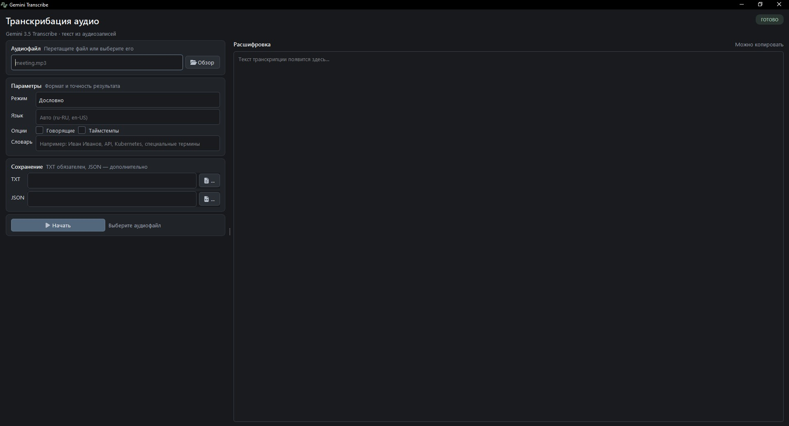

# Gemini 3.5 Transcribe

Небольшой CLI-скрипт для транскрибации аудиофайлов через модель Google `gemini-3.5-transcribe`.

## Возможности

- автоматическое определение языка и поддержка code-switching;
- режимы `verbatim` и `smart`;
- указание языка в формате BCP-47;
- разделение текста по говорящим;
- словесные таймстемпы;
- custom vocabulary для имён, терминов и аббревиатур;
- сохранение обычного TXT и полного JSON-ответа API;
- отдельное время транскрибации и общее время с загрузкой файла.

## Графическое приложение



В проекте есть GUI на PySide6 (`gui.py`) с тёмной профессиональной темой. Он поддерживает:

- выбор аудиофайла через диалог или drag-and-drop;
- режимы `verbatim` и `smart`;
- языки в формате BCP-47;
- разделение по говорящим и словесные таймстемпы;
- custom vocabulary;
- сохранение TXT и JSON;
- выполнение транскрибации в отдельном потоке, поэтому интерфейс остаётся отзывчивым.

Для запуска из исходников после установки зависимостей используйте:

```powershell
python .\gui.py
```

GUI проверяет API-ключ при запуске. Если ключ не найден, приложение покажет ожидаемый путь к `.env` и завершится.

## Установка

Требуется Python 3.10 или новее.

```powershell
python -m venv venv
.\venv\Scripts\Activate.ps1
python -m pip install -r requirements.txt
```

## API-ключ

Создайте файл `.env` рядом с `transcribe.py`:

```env
GEMINI_API_KEY=ваш_api_ключ
```

Не публикуйте `.env` и API-ключ в Git или в открытом доступе.

При запуске из исходников файл `.env` должен находиться рядом с `gui.py` и `transcribe.py`.
Для собранного приложения файл `.env` должен находиться рядом с `GeminiTranscribe.exe`, например:

```text
dist/
  GeminiTranscribe.exe
  .env
```

## Базовый запуск

```powershell
python .\transcribe.py .\1.mp3
```

По умолчанию результат сохраняется в файл с тем же именем и расширением `.txt`.

## Параметры

`--mode verbatim|smart`

- `verbatim` сохраняет содержание речи максимально буквально. Это режим по умолчанию.
- `smart` удаляет слова-паразиты и применяет умное форматирование.

```powershell
python .\transcribe.py .\1.mp3 --mode smart
```

`--language BCP-47`

Явно задаёт язык. Можно указывать несколько языков повторением параметра:

```powershell
python .\transcribe.py .\1.mp3 --language ru-RU
python .\transcribe.py .\meeting.mp3 --language ru-RU --language en-US
```

Если параметр не задан, модель определяет язык автоматически. Это также позволяет обрабатывать переключение языков внутри записи.

`--speaker-diarization`

Включает разделение текста по говорящим, например `Speaker 1` и `Speaker 2`.

```powershell
python .\transcribe.py .\meeting.mp3 --speaker-diarization
```

Поддерживается до 8 говорящих. Для трёх и более говорящих функция является экспериментальной.

`--timestamps`

Запрашивает таймстемпы каждого слова. При включённых `--speaker-diarization` или `--timestamps` TXT-файл содержит сегменты с говорящими и/или временными интервалами. `--json-output` дополнительно сохраняет исходные аннотации ответа API:

```powershell
python .\transcribe.py .\meeting.mp3 --timestamps --json-output .\meeting.json
```

`--vocabulary TERM`

Добавляет термин, имя или аббревиатуру в custom vocabulary. Параметр можно повторять:

```powershell
python .\transcribe.py .\interview.mp3 `
  --vocabulary Kubernetes `
  --vocabulary BigQuery `
  --vocabulary "Иван Петров"
```

API принимает до 1000 терминов, но Google рекомендует обычно ограничиваться примерно 100 наиболее важными терминами.

`--output PATH`

Задаёт путь к TXT-файлу:

```powershell
python .\transcribe.py .\1.mp3 --output .\result.txt
```

`--json-output PATH`

Сохраняет полный ответ API в JSON. Это полезно для аннотаций, таймстемпов и дополнительной диагностики:

```powershell
python .\transcribe.py .\meeting.mp3 --speaker-diarization --json-output .\meeting.json
```

## Комбинированные примеры

Чистая расшифровка с известным языком и терминами:

```powershell
python .\transcribe.py .\lecture.mp3 --mode verbatim --language ru-RU `
  --vocabulary "нейросеть" --vocabulary Python --output .\lecture.txt
```

Интервью с говорящими, таймстемпами и полным JSON:

```powershell
python .\transcribe.py .\interview.mp3 `
  --speaker-diarization `
  --timestamps `
  --json-output .\interview.json
```

Для `--speaker-diarization` и `--timestamps` используется режим `verbatim`. Скрипт отклоняет их совместно с `--mode smart`, потому что эти аннотации задаются в конфигурации verbatim.

## Ограничения модели

По официальной документации Google:

- обычная обработка аудиофайла: до 1 часа;
- при включённых говорящих или словесных таймстемпах: до 30 минут;
- автоматическое определение поддерживает более 85 языков;
- speaker diarization поддерживает до 8 говорящих;
- custom vocabulary: до 1000 терминов;
- кэширование, Batch API, function calling и thinking для этой модели не поддерживаются.

Для длинных файлов с диаризацией или таймстемпами разделите аудио на части до 30 минут.

## Сборка Windows-приложения

Сборка выполняется скриптом `build.bat`. Перед запуском убедитесь, что:

- создано виртуальное окружение `venv`;
- установлены зависимости из `requirements.txt`;
- рядом с `build.bat` находятся `gui.py`, `app.ico` и `.env`;
- в `.env` указан непустой `GEMINI_API_KEY`.

Запустите сборку из корня проекта:

```powershell
.\build.bat
```

Скрипт собирает GUI через PyInstaller в режиме `--onefile --windowed`, использует `app.ico` и создаёт:

```text
dist/
  GeminiTranscribe.exe
  .env
```

`.env` копируется рядом с EXE специально для загрузки ключа во время работы. Он не встраивается внутрь приложения. Не передавайте этот файл вместе с ключом третьим лицам.

После успешной сборки запустите приложение:

```powershell
.\dist\GeminiTranscribe.exe
```

Иконка приложения создаётся из `fa6s.wave-square` через QtAwesome. Для Windows также задаётся AppUserModelID, чтобы на панели задач отображалась иконка Gemini Transcribe, а не стандартная иконка Python.

## Проверка CLI

```powershell
python .\transcribe.py --help
```

Запуск реальной транскрибации требует действующего API-ключа и расходует квоту Gemini API.

## Официальная документация

- [Gemini 3.5 Transcribe](https://ai.google.dev/gemini-api/docs/models/gemini-3.5-transcribe)
- [Audio transcription через Interactions API](https://ai.google.dev/gemini-api/docs/transcribe)
- [Google Gen AI SDK для Python](https://github.com/googleapis/python-genai)
